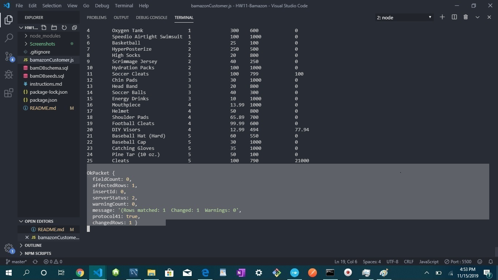

# Bamazon Application

## Application Overview 

 1. This basic CLI application is an Amazon-like storefront that uses node as a server and MYSQL as the database. The app will take in orders from customers and deplete stock from the store's inventory. 
 
 2. In the CLI, through the use of Node.js, you will also receive a response to your order with the total sales as well as the item purchased to you in the terminal. On the back end, it connects to the SQL database and changes the data in the tables dynamically. 

### Datbase Schema 
 The products table has each of the following columns:

   * item_id (unique id for each product)

   * product_name (Name of product)

   * department_name  

   * price (cost to customer)

   * stock_quantity (how much of the product is available in stores)

### Implementation (Screenshots of each provided below![by number])
1. Navigate to the root directory in which the `bamazonCustomer.js` file is in. Then, run an `npm install` command to the terminal

2. Navigate to the root directory in which the `bamazonCustomer.js` file is in. Then, run a `node bamazonCustomer.js` command into the terminal. 
    * The app will respond with two queries, the second dependent on the first. 
    * It which item you would like to buy. The answer ot this question shouild be the item_id shown in the table. The numbers are incremented from 1. 
    * The second question asks how many you would like to purchase. Keep note of the available items in stock, as some items may be out of stock and you will not be able to purchase these. 

3. After you enter these parameters, the terminal will respond with the name of the item you want to buy, the quantity, and the total cost. 

4. In addition, to be sure that the database has accepted your request, an OK packet is returned, and the database is updated. 

5. The next time you run the `node bamazonCustomer.js`  comnmand to the CLI, it will return the current database table with the updated info. The items you purchased are removed from the inventory and the total cost is added to the product_sales . 

### Pictures of Implementation (Correspond with Numbers Above (Implementation))

1. Dependency Downloads: 

2. Running the App: 

3. Response After Prompts: 

4. OK Packet: 

5. Updated Database: 

### Technologies Used 

1. Node.js

2. Vanilla js 

3. Node Packet Manager (NPM)
    * Inquirer 
    * mysql
    * console.table

4. SQL 

5. SQL Database

## My Role

I, Andrew Fowose am the sole developer of this application. 

